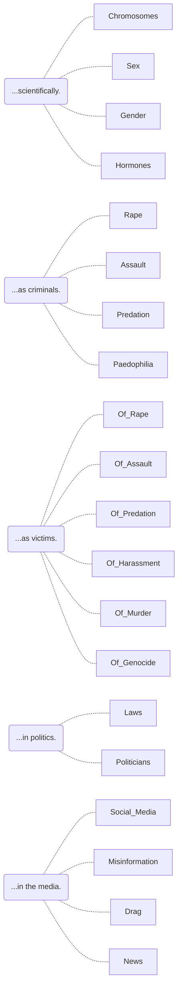

# Transinformative

A simple Q &amp; A format collection of facts on trans people, trans science, and trans life

## Trans people...

```mermaid
graph LR

    2(...scientifically.)
    3(...as criminals.)
    4(...as victims.)
    5(...in politics.)
    6(...in the media.)
    
    2 -.- Chromosomes
    2 -.- Sex
    2 -.- Gender
    2 -.- Hormones

    3 -.- Rape
    3 -.- Assault
    3 -.- Predation
    3 -.- Paedophilia

    4 -.- Of_Rape
    4 -.- Of_Assault
    4 -.- Of_Predation
    4 -.- Of_Harassment
    4 -.- Of_Murder
    4 -.- Of_Genocide

    5 -.- Laws
    5 -.- Politicians

    6 -.- Social_Media
    6 -.- Misinformation
    6 -.- Drag
    6 -.- News

```
